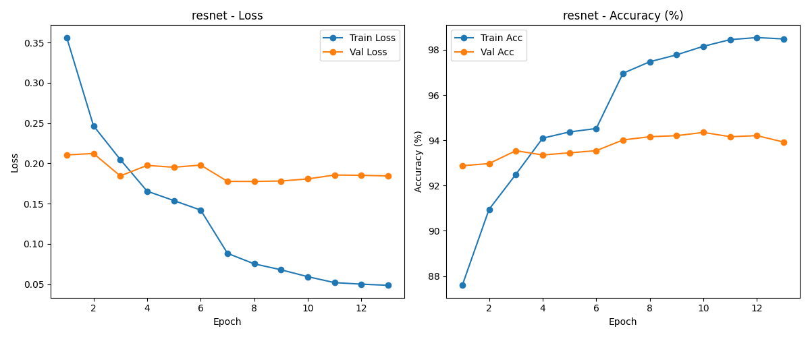
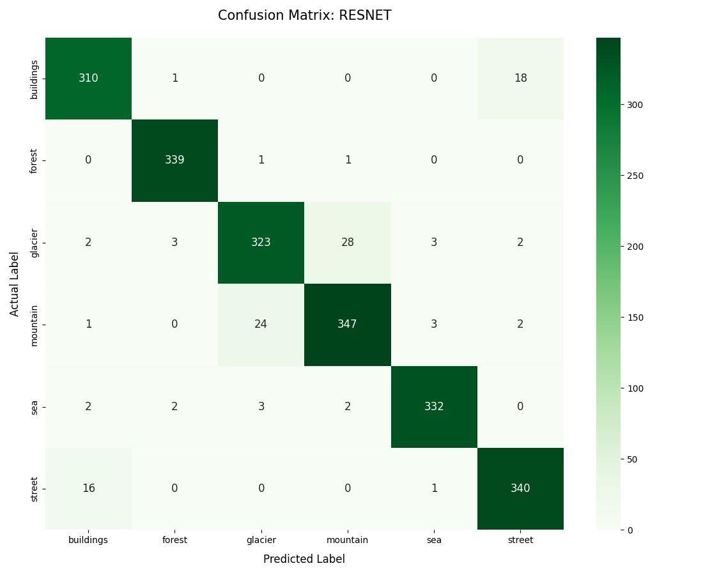
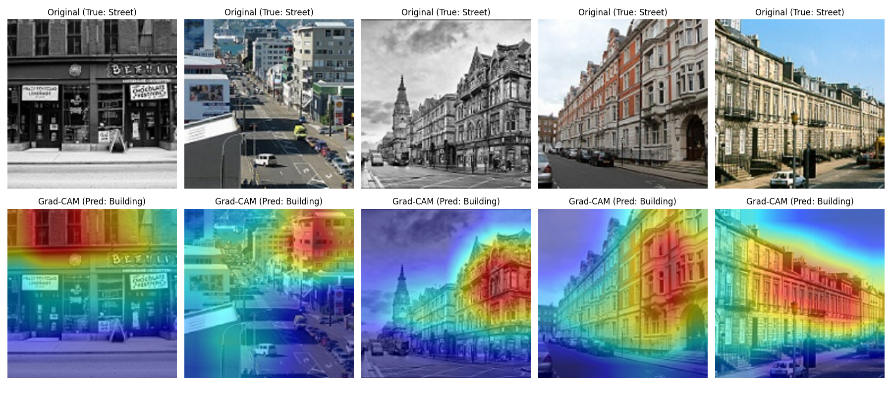

# Outdoor Scene Image Classification

## Project Overview
This project aims to build a deep learning model to classify outdoor scene images into six categories: **buildings, forest, glacier, mountain, sea, and street**. The goal is to complete an end-to-end (E2E) deep learning pipeline, including data exploration, model training, and evaluation.

## Project Structure

```
DL_OutdoorSceneClassfier
├── api/
│   └── main.py               # FastAPI implementation for model serving
├── data/
│   ├── raw/                  # Original dataset (Kaggle: Intel Scene)
│   └── processed/            # Preprocessed and split data (Train/Val/Test)
├── notebooks/
│   ├── dataset_info.ipynb    # EDA and dataset visualization
│   └── dataloader_debug.ipynb # Data pipeline verification & debugging
├── src/                      # Core modular components
│   ├── data_preprocessing.py # Script for data cleaning and splitting
│   ├── dataset.py            # Custom PyTorch Dataset classes
│   ├── model.py              # Architecture definitions (CNN & ResNet18)
│   ├── evaluate.py           # Evaluation logic for unseen test data
│   └── gradcam.py            # Grad-CAM logic for heatmaps
├── tools/                    # Utility and helper scripts
│   ├── print_model_summary.py # Prints model architecture and parameters
│   └── smoke_test.py         # Verifies the full forward/backward pass
├── train.py                  # Main entry point to start training tasks
├── run_diagnosis.py          # Script to execute model error analysis
└── README.md                 # Project documentation and experiment logs
 ```

## Key Engineering Features

* **Robust Training Pipeline**: 
    * **Early Stopping**: Automatically stops training when validation loss stops improving to prevent overfitting.
    * **Model Checkpointing**: Saves the best weights (`best_resnet.pth`) based on the lowest validation loss.
    * **Learning Rate Scheduling**: Dynamically reduces the learning rate (from $10^{-4}$ to $10^{-6}$) to fine-tune the model.
* **Experiment Tracking**: Integrated with **Weights & Biases (W&B)** to monitor metrics like Loss, Accuracy, and Learning Rate.
* **Model Diagnostics**: Uses **Grad-CAM** and **Confusion Matrix** to analyze model errors.

## Training Performance

The training process demonstrates high stability due to the Learning Rate Scheduler and Early Stopping. 

* **Best Generalization**: The model achieved its **lowest Validation Loss (0.1776) at Epoch 8**, which was saved as the final production model.
* **Peak Accuracy**: Validation Accuracy reached its peak of **94.35% at Epoch 10** before the Early Stopping mechanism triggered to prevent overfitting.



## Model Evolution & Results

I upgraded from a custom CNN to **ResNet18** using **Transfer Learning**, achieving **95.0% weighted average accuracy**.

| Model | Val Accuracy | F1-Score (Weighted) | Status |
| :--- | :---: | :---: | :--- |
| CNN Baseline | 82.3% | 0.81 | Benchmark |
| **ResNet18 (Optimized)** | **95.0%** | **0.95** | **Production Ready** |

### Class-wise Analysis
The **Confusion Matrix** below reveals that nature scenes (Forest, Sea) have near-perfect accuracy, while some confusion remains between "Glacier" and "Mountain."



## Model Diagnosis (Grad-CAM)

To understand why the model misclassified **16 "Street" images as "Buildings"**, I used **Grad-CAM** to visualize the attention maps.

**Discovery**: As shown below, the model focuses heavily on **architectural textures** (windows and walls) but ignores the lower **road/asphalt** features. This explains the confusion when buildings dominate the frame in street photos.



## Tech Stack

* **Framework**: PyTorch, Torchvision
* **Monitoring**: Weights & Biases (W&B)
* **API & Validation**: FastAPI, Pydantic
* **Hardware**: Trained on NVIDIA RTX 2060

