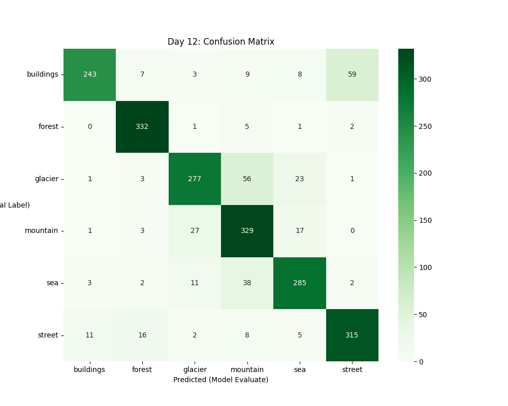
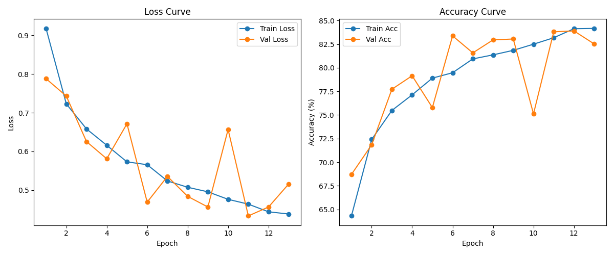
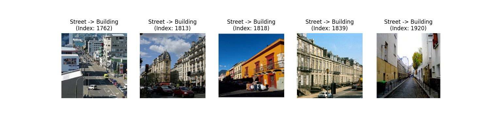

# Outdoor Scene Image Classification

## Project Overview
This project aims to build a deep learning model to classify outdoor scene images into six categories: **buildings, forest, glacier, mountain, sea, and street**. The goal is to complete an end-to-end (E2E) deep learning pipeline, including data exploration, model training, and evaluation.

## Project Structure
```
data/
 ├─ raw/                         # Original Kaggle dataset
 └─ processed/                   # Split into train/val/test
notebooks/
 ├─ dataset_info.ipynb
 └─ day5_dataloader_debug.ipynb  # Data pipeline verification
src/
 ├─ data_preprocessing.py
 └─ model.py                     # CNN Baseline architecture
outputs/                         # Training logs and visualizations
 ├─ learning_curve.png           # Visualized performance metrics
 ├─ metrics.json                 # Raw epoch-wise data for reproducibility
 └─ best_baseline.pth            # Automatically saved best model weights
train.py                         # Training & Validation pipeline
README.md
```

## Dataset
The dataset is based on the Intel Image Classification from Kaggle.
- Training data: `data/raw/seg_train`
- Test data: `data/raw/seg_test`
- Prediction data: `data/raw/seg_pred`
- Link: `https://www.kaggle.com/datasets/puneet6060/intel-image-classification/data`

## Exploratory Data Analysis (EDA)
An exploratory data analysis was performed to understand class distribution and data quality.
- Class Distribution: Six classes with ~2,200–2,500 images per class.
- Balance: The imbalance ratio (largest/smallest) is 1.14, indicating a well-balanced dataset.
- Data Quality: Visual inspection confirmed no obvious mislabeling or corrupted files.

## Data Preprocessing
Automated script to split raw training data into `train/val/test` sets.
- Resolution: $224 \times 224$ pixels.
- Split Ratio: 70% Train / 15% Val / 15% Test.

Command:
```bash
python src/data_preprocessing.py --raw_dir data/raw/seg_train --out_dir data/processed --val_ratio 0.15 --test_ratio 0.15 --img_size 224 --batch_size 32 --copy_mode copy
```

## Model Architecture: CNN Baseline
Implemented a modular CNN baseline in `src/model.py`.
- 4 Convolutional Blocks: Uses `Conv2d -> BatchNorm -> ReLU -> MaxPool`.
- Engineering Choice: Set `bias=False` in Conv layers since they are followed by BatchNorm, reducing redundant parameters.
- Global Pooling: Used `AdaptiveAvgPool2d((1, 1))` for input size flexibility.
- Regularization: Integrated `Dropout(p=0.3)` in the classifier to prevent overfitting.

## Training & Validation Pipeline
To ensure model robustness and prevent the overfitting observed in early experiments, we implemented several engineering best practices:
- **Model Checkpointing**: The training script now monitors `Validation Loss` and automatically saves the state dictionary `(best_baseline.pth)` only when performance improves. This prevents the "Epoch 10 Crash" where the final model is not necessarily the best one.
- **Early Stopping**: A patience-based trigger ($patience=3$) was added to terminate training if the validation loss stops decreasing. This optimizes training time and prevents weights from diverging.
- **Performance Tracking**: Full history of training metrics is exported to `metrics.json` for reproducibility.

## Training & Validation Results
Initial training was performed for 10 epochs to establish a performance benchmark.

| Metric | Epoch 1 | Epoch 5 | Epoch 10 |
| :--- | :---: | :---: | :---: |
| **Train Loss** | 0.9292 | 0.5608 | 0.4649 |
| **Train Acc** | 63.79% | 79.23% | **83.15%** |
| **Val Acc** | 75.26% | 77.87% | **72.03%** |

## Model Evaluation & Error Analysis (Day 12)
To move beyond simple accuracy metrics, a **Confusion Matrix** was generated to diagnose inter-class confusion.



### Key Insights:
- **High Recall in Nature Scenes**: The model performs exceptionally well on `Forest` (97% recall), likely due to distinct color and texture features.
- **Inter-class Confusion (Street vs. Buildings)**: Significant confusion exists between `Buildings` and `Street`. 
    - *Diagnosis*: Misclassified `Street` images often feature prominent vertical architectural structures that dominate the frame.
- **Geological Ambiguity**: `Glacier` and `Mountain` exhibit a 20% confusion rate, which is expected given their shared visual features (snow, jagged edges) in low-resolution inputs ($224 \times 224$).

## Visualizing Performance
We monitor the training process using automated logging. The following curves demonstrate the effectiveness of our **Early Stopping** mechanism.



## Iterative Optimization Strategy

### 1. Handling Overfitting
The baseline model initially overfitted at Epoch 10. By implementing **Model Checkpointing**, we ensured that `best_baseline.pth` captures the parameters with the lowest validation loss, rather than the final epoch's weights.

### 2. Visual Debugging (Error Analysis)
By visualizing samples where `Street` was misclassified as `Building`, we identified that the model relies heavily on **vertical geometry and window-like textures**. 

 
*(Note: If you saved your Day 12 misclassification plot as an image, link it here)*

**Insight**: The model lacks awareness of "ground-level" context (e.g., asphalt pavement) when buildings occupy >60% of the image.

## Experimental Analysis
- **Phase 1: Baseline Debugging** >   In the initial run, we observed a significant drop in Validation Accuracy at Epoch 10 ($82.34\% \rightarrow 72.03\%$), indicating strong overfitting.
- **Phase 2: Optimization** >   By applying Early Stopping and Model Checkpointing, we successfully:
 - Captured the model at its peak performance (Epoch 9, $Val\ Acc: 82.3\%$).
 - Reduced wasted compute cycles on an overfitting model.
 - Stabilized the training curve for more reliable inference.